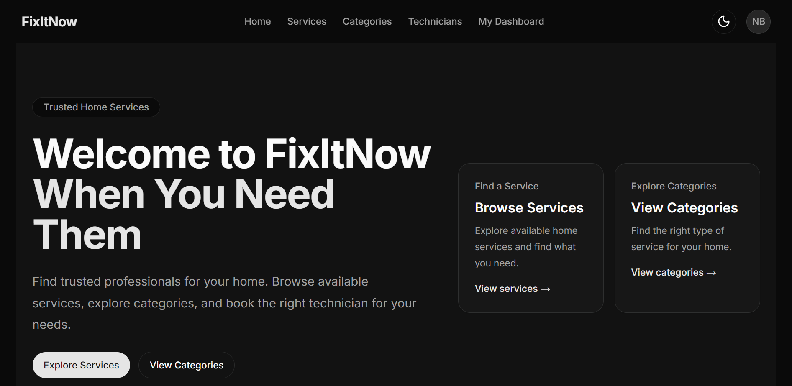
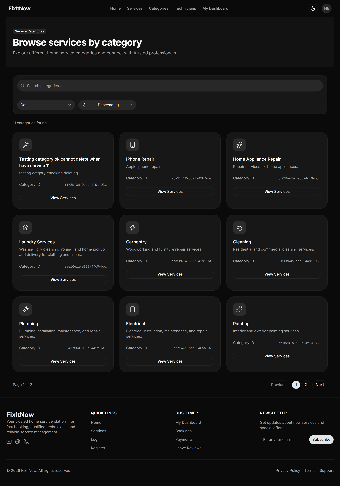
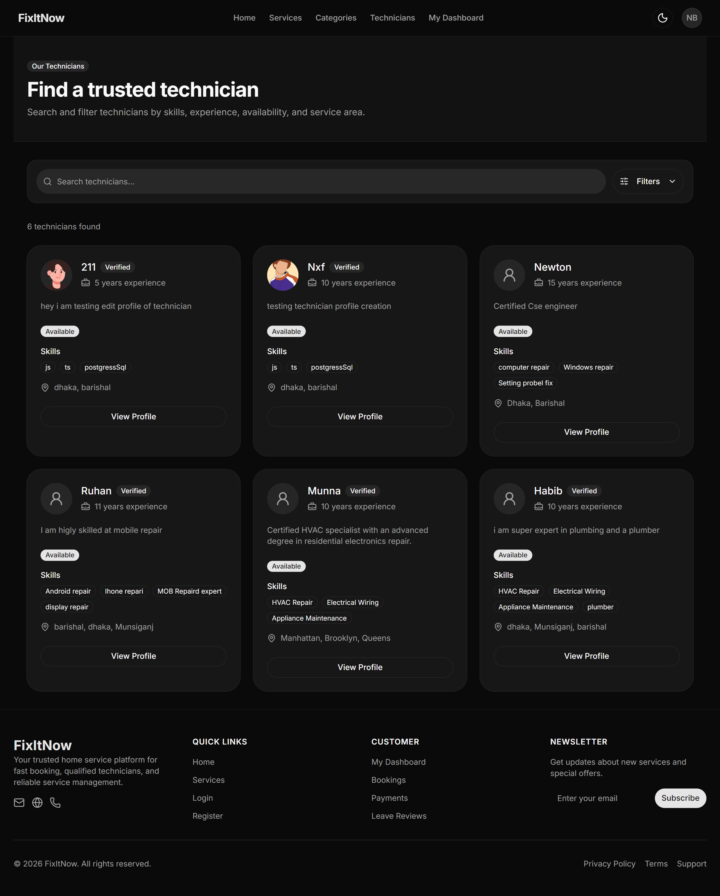
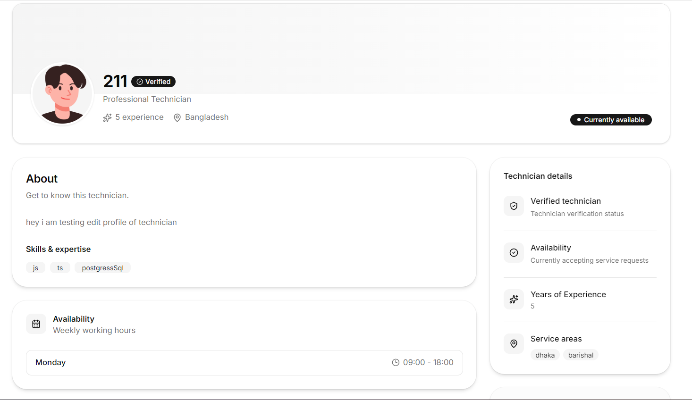
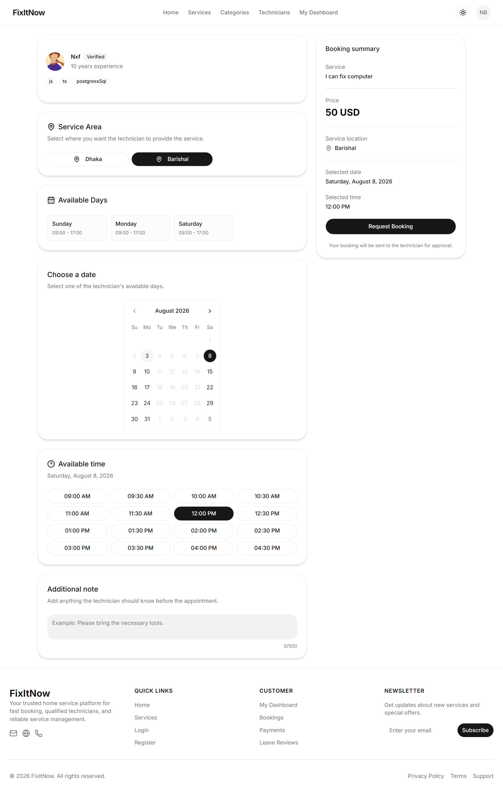
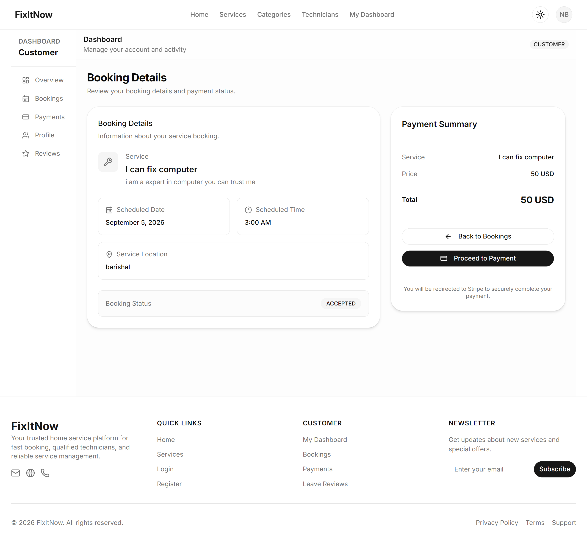
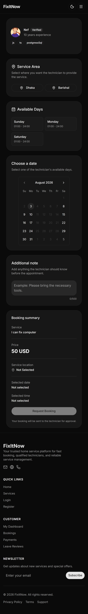

# FixItNow

FixItNow is a full-stack home service booking platform that connects customers with technicians for home repair and maintenance services.

Customers can discover services and technicians, create bookings, make payments through Stripe, manage their bookings, and leave reviews. Technicians can manage their profiles, services, availability, and booking requests. Admins can manage platform resources and users.

## 🚀 Project Links

- **Live Frontend:** [https://fix-it-now-frontend-ashen.vercel.app](https://fix-it-now-frontend-ashen.vercel.app)
- **Frontend Repository:** [https://github.com/Newton2n/fix-it-now-frontend](https://github.com/Newton2n/fix-it-now-frontend)
- **Live Backend API:** [https://fix-it-now-xi.vercel.app](https://fix-it-now-xi.vercel.app)
- **Backend Repository:** [https://github.com/Newton2n/fix-it-now-backend](https://github.com/Newton2n/fix-it-now-backend)
- **API Documentation:** [https://documenter.getpostman.com/view/53393171/2sBY4LQ2Ci](https://documenter.getpostman.com/view/53393171/2sBY4LQ2Ci)

---

## 📸 Screenshots

### Home Page



### Services Page



### Technicians Page



### Technician Profile



### Booking Form



### Booking Details



### Mobile Booking




---

## ✨ Features

### Authentication & Authorization

- User registration and login.
- JWT authentication.
- HTTP-only cookie authentication.
- Role-based authorization.
- Customer, Technician, and Admin roles.
- Protected resources.
- Logout functionality.

### Service Management

Customers can:

- Browse services.
- Search services.
- Filter services.
- Filter by category.
- Filter by price.
- Check service availability.
- View service details.

Technicians can:

- Create services.
- Update services.
- Delete services.
- Manage their own services.

### Technician Management

- Browse technicians.
- Search technicians.
- Filter by experience.
- Filter by skills.
- Filter by service area.
- Filter by availability.
- View technician profiles.
- Manage technician profile.
- Manage technician availability.

### Booking System

Customers can:

- Create bookings.
- View booking details.
- View booking history.
- Cancel bookings.
- Track booking status.

Technicians can:

- View booking requests.
- Accept bookings.
- Decline bookings.
- Update booking status.
- Manage ongoing bookings.

Booking statuses include:

- `REQUESTED`
- `ACCEPTED`
- `DECLINED`
- `CANCELED`
- `IN_PROGRESS`
- `COMPLETED`
- `PAID`

### Payment Integration

- Stripe Checkout.
- Checkout session creation.
- Booking-based payments.
- Payment history.
- Payment details.
- Stripe webhook handling.
- Payment status synchronization.

### Reviews & Ratings

Customers can:

- Create reviews.
- Add ratings.
- Update reviews.
- Delete reviews.
- View their reviews.

### Search, Filtering & Pagination

The application supports:

- Search.
- Filtering.
- Sorting.
- Pagination.
- Category filtering.
- Price filtering.
- Experience filtering.
- Availability filtering.

### Caching & Revalidation

The frontend uses Next.js caching for public data such as:

- Categories.
- Services.
- Services by category.
- Technicians.

Relevant cache tags are revalidated after mutations so updated data can be fetched without disabling caching globally.

---

## 🛠️ Tech Stack

### Frontend

- Next.js.
- React.
- TypeScript.
- Tailwind CSS.
- shadcn/ui.
- Radix UI.
- React Hook Form.
- Zod.
- Lucide React.

### Backend

- Node.js.
- Express.js.
- TypeScript.
- PostgreSQL.
- Prisma ORM.
- JWT.
- Zod.
- Cookie Parser.
- CORS.

### Payments

- Stripe Checkout.
- Stripe Webhooks.

### Tools

- Git.
- GitHub.
- Postman.
- npm.

---

## 🏗️ Architecture

FixItNow uses a separate frontend and backend architecture.

```text
                    ┌─────────────────────┐
                    │      Customer       │
                    └──────────┬──────────┘
                               │
                               ▼
                    ┌─────────────────────┐
                    │     Next.js App     │
                    │      Frontend       │
                    └──────────┬──────────┘
                               │
                         Server Actions
                               │
                               ▼
                    ┌─────────────────────┐
                    │    Express API      │
                    │      Backend        │
                    └──────────┬──────────┘
                               │
                  ┌────────────┴────────────┐
                  ▼                         ▼
         ┌─────────────────┐       ┌─────────────────┐
         │   PostgreSQL    │       │     Stripe      │
         │    + Prisma     │       │    Checkout     │
         └─────────────────┘       └─────────────────┘
```

## 🔐 Authentication Flow

FixItNow uses JWT-based authentication with HTTP-only cookies.

```text
User
 │
 ▼
Login / Register
 │
 ▼
Backend validates credentials
 │
 ▼
JWT Access Token
 │
 ▼
HTTP-only Cookie
 │
 ▼
Next.js Server Action
 │
 ▼
Express API
 │
 ▼
JWT Verification
 │
 ▼
Protected Resource
```

The frontend reads the authentication cookie on the server and forwards the access token to the backend API when making authenticated requests.

## 🔄 API Integration

The frontend communicates with the Express backend through Next.js Server Actions.

Server Actions are responsible for:

- Sending requests to the backend API.
- Reading authentication cookies.
- Forwarding access tokens.
- Validating request data.
- Handling API responses.
- Handling API errors.
- Revalidating cached data after mutations.

### Main API Resources

- `/api/auth`
- `/api/categories`
- `/api/service`
- `/api/technicians`
- `/api/booking`
- `/api/review`
- `/api/payment`
- `/api/user`
- `/api/admin`

### API Documentation

Full API documentation is available through Postman:

- [https://documenter.getpostman.com/view/53393171/2sBY4LQ2Ci](https://documenter.getpostman.com/view/53393171/2sBY4LQ2Ci)

## 🗄️ Data Management

The backend uses PostgreSQL as the primary database and Prisma ORM for database access.

Main application resources include:

- User.
- TechnicianProfile.
- Service.
- Category.
- Booking.
- Payment.
- Review.

The frontend does not communicate directly with PostgreSQL.

```text
Next.js Frontend
       │
       ▼
Next.js Server Actions
       │
       ▼
Express REST API
       │
       ▼
Prisma ORM
       │
       ▼
PostgreSQL
```

## ⚡ Caching & Revalidation

FixItNow uses different caching strategies depending on the type of data.

Public data that does not need to be fetched on every request can use Next.js caching and revalidation.

User-specific data such as payment history, reviews, and authenticated dashboard information is fetched without persistent data caching where fresh request-specific data is required.

### Public Cache Tags

- `all-category-home`
- `all-service`
- `services-by-category`
- `all-technician-home`
- `all-technician-admin`
- `all-users-admin`
- `all-payments-admin`

### Cache Revalidation

After mutations such as creating, updating, or deleting services, the relevant cache tags are revalidated.

```text
Create Service
      │
      ▼
Backend API
      │
      ▼
Success
      │
      ▼
revalidateTag("all-service")
      │
      ▼
Fresh service data on next request
```

This allows public resources to remain cached while still allowing updated data to become available after mutations.

## 🛡️ Validation & Error Handling

The frontend uses Zod schemas to validate user input before sending requests to the backend.

Validation is used for areas such as:

- User profile updates.
- Service creation.
- Service filtering.
- Category filtering.
- Booking data.
- Technician data.
- Review data.

API responses use a consistent success/error structure.

### Successful Response

```json
{
  "success": true,
  "message": "Operation completed successfully.",
  "data": {}
}
```

### Error Response

```json
{
  "success": false,
  "message": "Unable to complete the request.",
  "errorDetails": []
}
```

## 💳 Payment Flow

FixItNow integrates Stripe Checkout for booking payments.

```text
Customer
   │
   ▼
Select Booking
   │
   ▼
Create Checkout Session
   │
   ▼
Backend
   │
   ▼
Stripe Checkout
   │
   ▼
Customer Completes Payment
   │
   ▼
Stripe Webhook
   │
   ▼
Backend Webhook Handler
   │
   ▼
Payment Status Updated
```

The backend uses Stripe webhooks to process payment events and synchronize payment information with the application.

## 📱 Responsive Design

FixItNow is designed to work across desktop and mobile devices.

Responsive interfaces are provided for:

- Home page.
- Services.
- Technicians.
- Booking flow.
- Booking details.
- Technician profiles.
- Dashboard interfaces.

Mobile screenshots are available inside:

```text
public/
└── screenshot/
    ├── booking-mobile.png
    ├── services-mobile.png
    └── technician-mobile.png
```

## 🔎 Search, Filtering & Pagination

The application supports server-side search, filtering, sorting, and pagination.

### Services

Available filters include:

- Search.
- Category.
- Minimum price.
- Maximum price.
- Availability.
- Sorting.
- Pagination.

### Technicians

Available filters include:

- Search.
- Minimum experience.
- Availability.
- Skills.
- Service area.
- Sorting.
- Pagination.

### Categories

Available options include:

- Search.
- Sorting.
- Pagination.

## 👥 User Roles

FixItNow has three primary user roles.

### Customer

Customers can:

- Browse services.
- Browse technicians.
- Create bookings.
- Manage bookings.
- Make payments.
- View payment history.
- Create reviews.
- Update reviews.
- Delete reviews.
- Manage their profile.

### Technician

Technicians can:

- Create a technician profile.
- Update their profile.
- Manage skills.
- Manage service areas.
- Manage availability.
- Create services.
- Update services.
- Delete services.
- View booking requests.
- Accept bookings.
- Decline bookings.
- Update booking status.

### Admin

Admins can manage platform-level resources and users.

## 📁 Frontend Project Structure

```text
src/
├── actions/
│   ├── auth/
│   ├── booking/
│   ├── category/
│   ├── payment/
│   ├── review/
│   ├── service/
│   ├── technician/
│   └── user/
│
├── app/
│   ├── (auth)/
│   ├── (dashboard)/
│   ├── services/
│   ├── technicians/
│   └── ...
│
├── components/
│   ├── booking/
│   ├── dashboard/
│   ├── service/
│   ├── technician/
│   ├── ui/
│   └── ...
│
├── schema/
│   ├── booking/
│   ├── category/
│   ├── service/
│   ├── technician/
│   └── user/
│
├── types/
│   ├── api.ts
│   ├── booking.ts
│   ├── payment.ts
│   ├── review.ts
│   ├── service.ts
│   ├── technician.ts
│   └── user.ts
│
└── utils/
    └── jwt.ts
```

## ⚙️ Environment Variables

Create a `.env.local` file in the frontend project.

```env
BACKEND_API=your_backend_api_url
JWT_ACCESS_SECRET=your_jwt_access_secret
```

Do not commit real secrets or private credentials to the repository.

For production, configure environment variables through the hosting platform.

## 🚀 Getting Started

1. Clone the repository.

```bash
git clone https://github.com/Newton2n/fix-it-now-frontend.git
```

2. Navigate to the project.

```bash
cd fix-it-now-frontend
```

3. Install dependencies.

```bash
npm install
```

4. Configure environment variables.

```env
BACKEND_API=your_backend_api_url
JWT_ACCESS_SECRET=your_jwt_access_secret
```

5. Start the development server.

```bash
npm run dev
```

The frontend will run at:

```text
http://localhost:3000
```

## 🔗 Backend Setup

The frontend requires the FixItNow backend API.

Clone the backend repository separately:

```bash
git clone https://github.com/Newton2n/fix-it-now-backend.git
```

For local development, configure the frontend with:

```env
BACKEND_API=http://localhost:5000
```

Make sure the backend API is running before using API-dependent frontend features.

## 🧪 Testing API Endpoints

The API can be tested using Postman.

The API documentation contains available endpoints, request parameters, request bodies, and expected responses.

### Main API Areas

- Authentication.
- Categories.
- Services.
- Technicians.
- Bookings.
- Payments.
- Reviews.
- Users.
- Admin Operations.

### API Documentation

- [https://documenter.getpostman.com/view/53393171/2sBY4LQ2Ci](https://documenter.getpostman.com/view/53393171/2sBY4LQ2Ci)

## 🌐 Deployment

### Frontend

The frontend is deployed on Vercel.

- [https://fix-it-now-frontend-ashen.vercel.app](https://fix-it-now-frontend-ashen.vercel.app)

### Backend

The backend API is deployed on Vercel.

- [https://fix-it-now-xi.vercel.app](https://fix-it-now-xi.vercel.app)

The frontend communicates with the production backend through:

```env
BACKEND_API=https://fix-it-now-xi.vercel.app
```

## 🔒 Production Considerations

Before deploying the application, make sure the following are configured correctly:

- Production backend URL.
- JWT secrets.
- Secure HTTP-only cookies.
- CORS configuration.
- PostgreSQL production database.
- Stripe production configuration.
- Stripe webhook configuration.
- Frontend environment variables.
- Backend environment variables.

Never expose private secrets in client-side code or commit them to Git.

## 📋 Project Checklist

- Authentication.
- JWT authentication.
- HTTP-only cookies.
- Role-based authorization.
- Customer functionality.
- Technician functionality.
- Admin functionality.
- Service management.
- Technician management.
- Booking system.
- Booking status management.
- Stripe Checkout.
- Stripe webhook integration.
- Payment history.
- Reviews and ratings.
- Search.
- Filtering.
- Sorting.
- Pagination.
- Responsive design.
- API integration.
- Zod validation.
- Next.js caching.
- Cache revalidation.
- API documentation.

## 📚 Documentation

- Next.js Documentation.
- Stripe Documentation.
- Postman API Documentation.

## 👨‍💻 Author

Newton  
Full Stack Developer  
Focused on building full-stack applications with:

- TypeScript.
- Next.js.
- React.
- Node.js.
- Express.js.
- PostgreSQL.
- Prisma.
- Tailwind CSS.

## 📄 License

This project is built for educational and portfolio purposes.